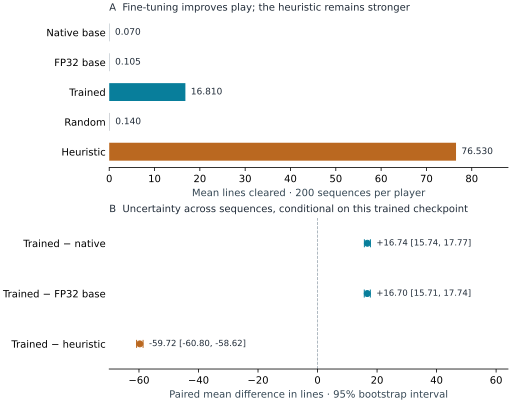
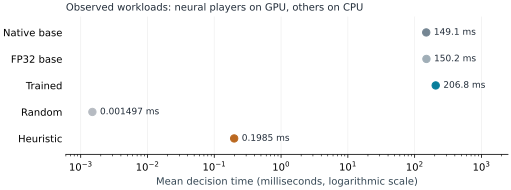

# Stackcraft: Adapting Clef-flash to a Falling-Block Decision Task

Nima Karimi · 2026-10-06 · Version 1.0

**Technical report · Not peer reviewed**

## Abstract

Can a general decision model learn a useful game policy from a small synthetic
dataset on one workstation? Stackcraft studies this question in a deterministic,
turn-based falling-block game. A Clef-flash model was adapted using rank-4 LoRA
and its full native decision head, with 827 training positions and 215 validation
positions labeled by a bounded search teacher. One training run produced two
checkpoint candidates; validation negative log likelihood selected the second.
Across 200 previously reserved piece sequences per policy, the selected model
cleared 16.81 lines per game, versus 0.07 for unchanged Clef-flash. The paired
improvement was 16.74 lines, with a 95% bootstrap interval of [15.74, 17.77].
However, a fixed arithmetic heuristic cleared 76.53 lines and was substantially
faster. All 1,000 evaluated episodes completed without inference errors or invalid
decisions. The study demonstrates task adaptation under a constrained local
budget, while showing why improvement over a weak base model is insufficient
evidence of practical superiority. Code, data, learned parameters, recorded games,
and verification evidence are public. This is a technical report, not a
peer-reviewed publication.

## 1. Motivation and scope

A falling-block game offers a concrete test of decision quality: choices alter
the board, mistakes accumulate, and complete games expose failures that isolated
classification scores can hide. Stackcraft asks whether a small imitation-learning
dataset can improve a general decision model, and whether that improvement is
competitive with a simple task-specific policy. The project also makes the
experiment inspectable through replayable games and milestone tutorials.

Clef-flash is a roughly nine-billion-parameter model derived from Qwen3.5-9B.
Its native interface accepts a state and typed questions, then produces
probabilities over supplied options through a joint decision head. This avoids
requiring a generated command or a text parser to select a legal move. Stackcraft
uses text and structured state only; it does not test the model's visual
capabilities. The implementation follows the pinned upstream interface. [[1]](https://huggingface.co/Cloudflare/clef-flash/blob/17f0b0ad64efb65d273590632833508766b2aae6/README.md)

The contribution is an engineering case study with released evidence. No new
adaptation algorithm, general game-playing advance, or superiority over
specialized game agents is claimed. The central distinction is between learning
to play better than the unchanged model and building the best bot for these rules.

## 2. Game and policy interface

The board has ten columns and twenty rows. Seven tetromino shapes arrive in
seeded seven-bag sequences: each shuffled bag contains every shape once. A turn
chooses a legal orientation and column, then drops the piece vertically. The
rules omit hold, wall kicks, tucks, T-spin bonuses, and real-time movement
requirements. Clearing one, two, three, or four lines awards 100, 300, 500, or
800 points. Lines cleared per episode is the primary outcome.

Every policy receives the board, current piece, one next-piece preview, and the
same legal placement options. Hidden future pieces, the episode seed, sequence
index, and generator state are excluded from the observation. Python owns the
authoritative transitions, so browser play, offline tournaments, and replay
validation use the same rules. This is a structured placement task rather than a
benchmark of full competitive Tetris.

Five policies were evaluated. **Native base** retains unchanged Clef-flash weights
and its original BF16 head. **FP32 base** uses unchanged weights with the FP32 head
wrapper used for training. **Trained** combines the selected LoRA adapter with the
learned FP32 head. All three share the pinned backbone, observation encoding,
option ordering, BF16 backbone precision, and 4,096-token limit. Full observations
are checked against that limit before inference.

**Random** samples uniformly from legal options using a recorded random generator.
**Heuristic** greedily evaluates the resulting board with a fixed formula:
negative aggregate column height, minus four times the number of holes, minus
adjacent-column height differences, plus eight times the number of cleared lines.
A hole is an empty cell below an occupied cell in its column. The heuristic does
not use the available preview; its weights were frozen before final testing. It
is distinct from the lookahead teacher that generated training labels. [[3]](https://github.com/kkarimi/stackcraft/blob/82a8854258f228a214f0964bbbd3d2b52e2be1e5/reports/final-study.md)

## 3. Synthetic data and adaptation

### Data construction

The dataset contains 827 training positions from seeds 10000–10023 and 215
validation positions from seeds 20000–20005. Collection cycles among random,
greedy-heuristic, and search-expert behavior, recording at most forty moves per
episode. This exposes the learner to boards produced by different policies rather
than only successful expert trajectories. Every episode belongs to one split.
Occupancy-normalized duplicate detection removed six repeated training positions
and two validation positions that overlapped the training split.

For each retained observation, the teacher enumerates legal placements of the
current piece and the one visible preview, then evaluates line clears and board
quality. It cannot inspect unseen pieces. Its chosen action is a deterministic,
bounded-search recommendation, not a globally optimal label. The released dataset
records legal choices, teacher values, labels, source identity, and split
provenance. It is programmatically generated synthetic data; it is not a corpus
of human gameplay or human-certified optimal decisions. The reserved test seeds
30000–30199 were excluded from collection and checkpoint selection. [[4]](https://huggingface.co/datasets/nima1/stackcraft-data/tree/211708dd56f1a8af711c060c2ab1ecab35e7166d)

### Training configuration

LoRA adds trainable low-rank weight updates while retaining frozen backbone
parameters. [[2]](https://arxiv.org/abs/2106.09685) Here it was applied to the text backbone alongside full training
of Clef's native joint head. A single seed-42 run used rank 4, alpha 8, zero
adapter dropout, a BF16 unquantized backbone, and an FP32 head. The combined
trainable parameter count was 132,582,404. This count includes the full head;
“LoRA” should not be read as implying that only a tiny adapter was trained.

Training ran for exactly two epochs. The objective combined cross-entropy with
0.05 label smoothing and a Brier-loss term weighted by 0.1. AdamW used a learning
rate of 0.00001 and weight decay 0.01. Batch size was one, gradient accumulation
was eight, and gradient norm clipping was 1.0. Each epoch processed all 827
positions in 104 optimizer steps. The final accumulation group used its actual
three examples for normalization. Recorded hashes confirmed that frozen
parameters remained unchanged while intended trainable parameters changed.

### Selection and reload checks

The two epoch checkpoints were the entire preregistered selection search.
Eligibility required complete, finite predictions on all 215 validation positions;
selection minimized mean target negative log likelihood (NLL), with exact ties
going to the earlier epoch. Both candidates qualified, and epoch 02 was selected.
Teacher agreement and Brier scores were diagnostics, not alternative selection
criteria. The local preregistration was preserved in source; it was not a signed
external registration.

| Condition | Teacher agreement | Mean NLL | Mean Brier |
| --- | --- | --- | --- |
| Native base | 21/215 (9.77%) | 2.952702 | 0.923173 |
| FP32 base | 22/215 (10.23%) | 2.952393 | 0.923102 |
| Epoch 01 | 89/215 (41.40%) | 1.860870 | 0.722190 |
| Epoch 02 (selected) | 92/215 (42.79%) | 1.775923 | 0.708980 |

*Table 1. Validation results on all 215 positions. Lower NLL and Brier values are
better. The second epoch was selected before test games were opened.*

The selected model agreed with 92 teacher actions, or 42.79%. That percentage is
not a game-quality score. Alternative moves may be useful, teacher tie-breaking
can affect agreement, and a wrong move changes the states encountered later.
Complete held-out games therefore provide the behavioral evaluation.

The checkpoint saves both the adapter and native head. A fresh-process reload
matched four fixed training-position reference distributions exactly, with a
maximum absolute probability difference of 0.0 against a declared tolerance of
0.0001. The same four-reference check later passed using anonymously downloaded
published code and weights. These checks establish serialization consistency on
those references, not correctness on every board. [[3]](https://github.com/kkarimi/stackcraft/blob/82a8854258f228a214f0964bbbd3d2b52e2be1e5/reports/final-study.md), [[5]](https://github.com/kkarimi/stackcraft/blob/ad348c20820061b130abfc2890ab8de00b62e7e4/reports/publication.md)

## 4. Held-out evaluation

Each policy played the same 200 held-out sequences, seeds 30000–30199, with a cap
of 200 placed pieces per episode. The tournament therefore contains 1,000
episodes. A cap hit means survival for at least 200 pieces; it is not a loss on
piece 200. No model, prompt, policy, dataset, or checkpoint was tuned after opening
this final test.

Comparisons subtract outcomes within each seed. The analysis resamples the 200
paired episode differences with replacement 10,000 times, using bootstrap seed
2026, and takes percentile 95% intervals. Resampling episodes retains dependence
among decisions in the same game. The primary contrast is trained minus native
base in lines cleared. Score and survival intervals are descriptive secondary
results without a multiplicity correction.

| Player | Mean lines | Median lines | Mean score | Mean pieces | Cap hits |
| --- | --- | --- | --- | --- | --- |
| Native base | 0.070 | 0 | 7.0 | 26.020 | 0/200 |
| FP32 base | 0.105 | 0 | 10.5 | 26.000 | 0/200 |
| Trained | 16.810 | 16 | 1745.5 | 83.565 | 0/200 |
| Random | 0.140 | 0 | 14.0 | 26.645 | 0/200 |
| Heuristic | 76.530 | 77 | 8306.5 | 200.000 | 200/200 |

*Table 2. Held-out outcomes for 200 episodes per policy. Survival is pieces
placed. All five policies recorded zero inference errors and invalid decisions.*

*Figure 1. Mean lines cleared and paired differences for the selected checkpoint.
Intervals describe variability across held-out sequences for this checkpoint,
not variation across independently trained models.*

The trained model cleared 16.81 lines on average, compared with 0.07 for native
base: a gain of 16.74 lines, 95% interval [15.74, 17.77]. The gain against FP32 base
was 16.705 [15.705, 17.740]. The FP32-minus-native difference was only 0.035
[−0.020, 0.090], so changing head precision alone does not explain the observed
adaptation gain. This comparison does not separate learned adapter effects from
learned head effects; both were optimized together.

The heuristic remained substantially stronger, clearing 76.53 lines on average.
The trained-minus-heuristic difference was −59.720 [−60.805, −58.619875]. Every
heuristic episode reached the cap; no other policy did. Its unrestricted survival
is consequently unknown. No failed episodes were removed. The frozen analysis
would assign zero lines, score, and survival to an errored episode while retaining
its partial outcome separately; because there were no errors, adjusted and
observed results coincide.

An independently implemented audit reconstructed all 1,000 saved episodes,
checked observations and legal choices, verified source and checkpoint bindings,
and recomputed all twelve paired intervals across lines, score, and survival.
It matched the published results. This was a separate code-path check by another
AI agent, not external scientific replication. [[3]](https://github.com/kkarimi/stackcraft/blob/82a8854258f228a214f0964bbbd3d2b52e2be1e5/reports/final-study.md)

## 5. Runtime and practical value

Experiments ran on an NVIDIA RTX 5090 with roughly 32 GB of VRAM, an AMD Ryzen 9
9950X3D, and about 123 GiB of host RAM. The recorded environment used Python
3.13.16, Torch 2.14.1+cu130, CUDA 13.0, Transformers 5.18.0, and PEFT 0.21.2.
Torch used eight CPU threads and TF32 was disabled.

| Player | Mean ms | Median ms | p95 ms | Decisions |
| --- | --- | --- | --- | --- |
| Native base | 149.109957 | 139.381274 | 244.916266 | 5,204 |
| FP32 base | 150.188366 | 140.968013 | 247.879591 | 5,200 |
| Trained | 206.814401 | 171.844287 | 309.000088 | 16,713 |
| Random | 0.001497 | 0.001250 | 0.002879 | 5,329 |
| Heuristic | 0.198510 | 0.139489 | 0.280528 | 40,000 |

*Table 3. Per-decision timings over each policy's actual tournament workload.
Initialization is excluded; no warmup calls within the tournament were removed.*

*Figure 2. Observed mean decision latency. Neural policies use the GPU; random and
heuristic policies use the CPU. Different policies visit different boards, so
this is not a controlled same-state speed benchmark.*

Decision timings include encoding and probability transfer, but exclude model
loading, rendering, and replay serialization. The trained mean was 206.814 ms,
versus approximately 0.198510 ms for the heuristic: about 1,042 times longer on
these workloads. The trained policy also saw longer inputs on average than either
unchanged model. These measurements support choosing the heuristic for a practical
bot under the tested rules; they do not isolate a hardware-independent inference
speed ratio.

Training took 1,511.25 seconds, or 25.2 minutes, including checkpoint and hash
work. Peak CUDA allocation was 23.23 GB (21.64 GiB), with 24.18 GB reserved.
The final evaluation wrapper took 5,103.11 seconds, or 85.1 minutes, including
loading, reporting, and service restoration checks. These durations exclude
previous development, validation, and data generation. Energy use and monetary
cost were not measured. [[3]](https://github.com/kkarimi/stackcraft/blob/82a8854258f228a214f0964bbbd3d2b52e2be1e5/reports/final-study.md)

## 6. Limitations and next experiments

The strongest limitation is the single training seed. The bootstrap intervals
measure variability across episode sequences for one selected model; they do not
quantify training instability. The dataset is small and synthetic, and its teacher
optimizes a short-horizon approximation. Collection stops after at most forty
moves, whereas test games can last two hundred. Errors may therefore lead the
policy into poorly represented states, although this study does not establish a
causal failure mechanism.

Only one structured encoding, one adaptation configuration, and two epoch
candidates were studied. The weak unchanged-model result characterizes that pinned
model under this interface, not every possible use of Clef-flash. The rules omit
many skills relevant to real-time Tetris. The heuristic's universal cap hits limit
claims about its full survival distribution. None of these findings establishes
performance on a different game, board representation, or deployment platform.

Useful follow-up studies could compare head-only training with joint head/LoRA
training, repeat training across seeds, and evaluate a compact game-specific
student against the same inexpensive heuristic. Gathering recovery states from
the learned policy could test whether broader state coverage improves complete
games. Those are proposed experiments, not measured improvements. Any follow-up
should declare its selection procedure and reserve fresh test sequences rather
than repeatedly optimizing against the published test set.

## 7. Reproducibility and availability

The public code repository includes the game, experiment scripts, tests, a locked
uv environment, and tutorials. The model release includes the adapter, learned
head, reproduction source, and a lossless evidence archive with 1,017 records.
The archive's inventory preserves uncompressed file hashes. Anonymous downloads
of the pinned model and dataset passed byte and schema verification; all archive
entries were read and hashed. The published reload check used downloaded source
and checkpoint files. [[5]](https://github.com/kkarimi/stackcraft/blob/ad348c20820061b130abfc2890ab8de00b62e7e4/reports/publication.md)

The frozen model release is
`c4272310bd6c63ee97a941255abf8f36ff162229`; the dataset release is
`211708dd56f1a8af711c060c2ab1ecab35e7166d`. The bundled release source is
`82a8854258f228a214f0964bbbd3d2b52e2be1e5`. These identify the experimental
artifacts, not the later additive PDF publication. The upstream Clef-flash
revision is `17f0b0ad64efb65d273590632833508766b2aae6`. [[1]](https://huggingface.co/Cloudflare/clef-flash/blob/17f0b0ad64efb65d273590632833508766b2aae6/README.md), [[4]](https://huggingface.co/datasets/nima1/stackcraft-data/tree/211708dd56f1a8af711c060c2ab1ecab35e7166d), [[6]](https://huggingface.co/nima1/stackcraft-clef-flash-lora/tree/c4272310bd6c63ee97a941255abf8f36ff162229)

Provenance distinguishes stages rather than assigning every result to the release
commit. Data generation used commit `70d84bd8dc5d4a60f3b96455a57d9e6f9416d109`.
Training recorded `d9fcd05c02e9327d4d791f2338725092cede8bdd` with a dirty working
tree and explicit source-file hashes; that commit alone is not the full training
source identity. Final evaluation used clean commit
`e524f0c15c2dd60ebfdc1374d66836c79e1e6dd6`. The retained reports and source hashes
are the authoritative record of these distinctions. [[3]](https://github.com/kkarimi/stackcraft/blob/82a8854258f228a214f0964bbbd3d2b52e2be1e5/reports/final-study.md)

The local browser demo pairs live human play with clearly labeled recordings from
the actual base, trained, and heuristic policies. Playback speed is not live
neural inference speed. Hosted CPU deployment is deferred; no public running
Space is claimed. Readers can inspect evidence and replay games without retraining
or renting a GPU.

## Assistance disclosure

AI coding agents assisted with implementation, experiment orchestration,
documentation, manuscript preparation, and computational review under the project
owner's direction. The separate audit used another agent and an independent
implementation, but was part of this project. Synthetic labels came from the
programmatic search teacher. No external peer review, independent laboratory
replication, or exhaustive human labeling review is claimed.

## References

1. Cloudflare. [Clef-Flash model card and native interface, pinned revision](https://huggingface.co/Cloudflare/clef-flash/blob/17f0b0ad64efb65d273590632833508766b2aae6/README.md).
2. Hu, E. J., et al. (2021). [LoRA: Low-Rank Adaptation of Large Language Models](https://arxiv.org/abs/2106.09685).
3. Stackcraft. [Frozen study report and linked experimental evidence](https://github.com/kkarimi/stackcraft/blob/82a8854258f228a214f0964bbbd3d2b52e2be1e5/reports/final-study.md).
4. Stackcraft. [Synthetic dataset and provenance, pinned release](https://huggingface.co/datasets/nima1/stackcraft-data/tree/211708dd56f1a8af711c060c2ab1ecab35e7166d).
5. Stackcraft. [Publication and fresh-download verification report](https://github.com/kkarimi/stackcraft/blob/ad348c20820061b130abfc2890ab8de00b62e7e4/reports/publication.md).
6. Stackcraft. [Adapter, native head, source, and evidence, pinned release](https://huggingface.co/nima1/stackcraft-clef-flash-lora/tree/c4272310bd6c63ee97a941255abf8f36ff162229).
